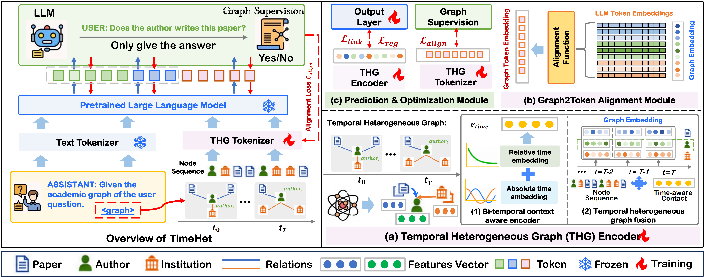

# TimeHet
<h1 align="center">Temporal Heterogeneous Graph Tokenization (TimeHet)</h1>

This is the code associated with the paper "Temporal Heterogeneous Graph Tokenization" accepted by ICDM 2026.

## Setup

```bash
conda create -n temgh python=3.10
conda activate temgh
pip install torch==2.1.2 --index-url https://download.pytorch.org/whl/cu118
pip install dgl -f https://data.dgl.ai/wheels/torch-2.4/cu118/repo.html
pip install -r requirements.txt
```

## Model Weights

Please download the Vicuna-7B-v1.3 checkpoints from this [link](https://huggingface.co/lmsys/vicuna-7b-v1.3) and put them under the `./LLM/` directory.

## Data

Place datasets under `./data/`:
- COVID: `data/covid/covid_graphs.bin`
- MAG: `data/ogbn-mag/ogbn_graphs.bin`, `data/mp2vec/`
  ```bash
  cd data/ogbn-mag
  cat ogbn_graphs.zip.001 ogbn_graphs.zip.002 ogbn_graphs.zip.003 ogbn_graphs.zip.004 ogbn_graphs.zip.005 ogbn_graphs.zip.006 > ogbn_graphs.zip
  unzip ogbn_graphs.zip
  ```
- Wiki: `data/wiki/tgb_processed/`

## Usage

**COVID Node Regression (TEMGH + MLP)**
```bash
python run_regression.py
```
Results and checkpoints are saved under `./checkpoints/covid_reg/`.

**MAG Link Prediction (TEMGH + GraphProjector + LLM)**
```bash
python pretrain_temhg.py --dataset mag_link
python run_linkpre.py --config experiments/mag_link/config.yaml
```

**Wiki Link Prediction**
```bash
python pretrain_temhg.py --dataset wiki_link
python run_linkpre.py --config experiments/wiki_link/config.yaml
```
